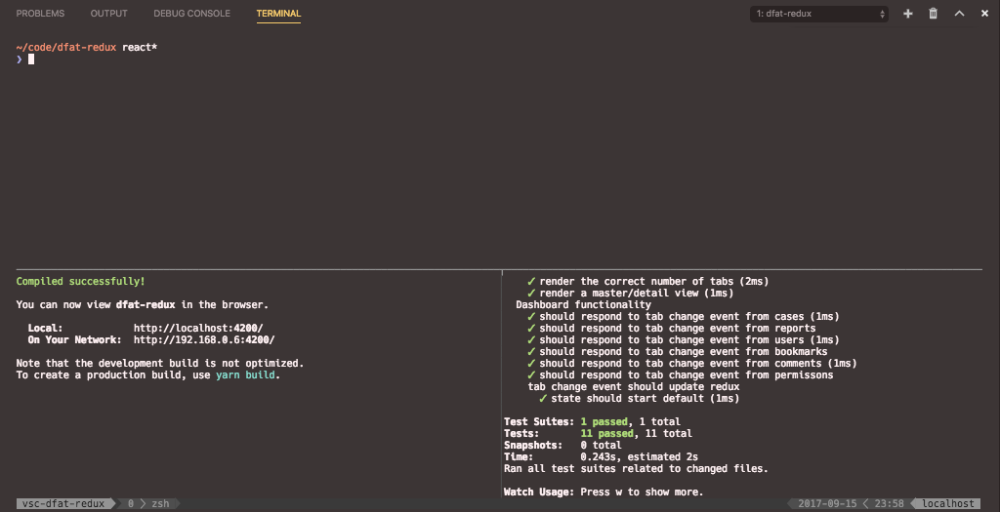

# Mux

Manage [tmux](https://github.com/tmux/tmux) from the safety of your editor!

Mux aims to be a thin wrapper around tmux (possibly screen soon), providing an interface to allow you to describe layouts which will be called by tmux.

**There be dragons here.** This might work beautifully and make you 10,00% more productive, but it's just as likely to set your Hue lights on fire and empty your bank account.

## Commands provided

### Show Mux

The bread and butter, reads your configuration(s) and uses them to create a layout. As it's just using standard tmux, you are feel free to attach from any terminal on the system (or even SSH in from another system!).

### Kill mux sessions using current prefix

Using the *currently configured* prefix, allows you to kill a specific session running.

### Kill mux session for current project

Attempst to kill the Mux session running on the current project.

### Configure Mux

Unimplemented currently, but will be used to open the relevant configuration file currently being used.

## Schema

Currently the schema is quite simplistic and only supports creating simple splits and windows.

For example, a schema that looks like

```json
{
    "mux.projectConfiguration": {
        "session": {
            "windows": [
                {
                    "command": "zsh",
                    "splits": [
                        {
                            "isHorizontal": false,
                            "command": "yarn start"
                        },
                        {
                            "isHorizontal": true,
                            "command": "yarn test"
                        }
                    ]
                }
            ]
        }
    }
}
```

would give a layout that looks like



Support for move advanced things like pane sizes and naming windows is comming soon™.

## Contributing

Below are some example commands to get you started contributing:

- `git clone https://github.com/elken/mux`
- `git checkout -b my-awesome-feature-name`
- `echo "I'm helping!" > src/extension.ts`
- `git add --all .`
- `git commit -m "I'm helping, honest!"`
- `git push`

Then drop me a pull request on GitHub (or from the command line if you use [hub](https://www.github.com/github/hub))

Config files for linters and editorconfig are coming soon™.

## Credits

The theme I use in screenshots is [Monokai Pro](https://monokai.pro/) and my tmux setup is [here](https://github.com/elken/dotfiles/blob/master/.tmux.conf).

[Tmux](https://github.com/tmux/tmux/) is actively developed and maintained by a number of very talented coders.